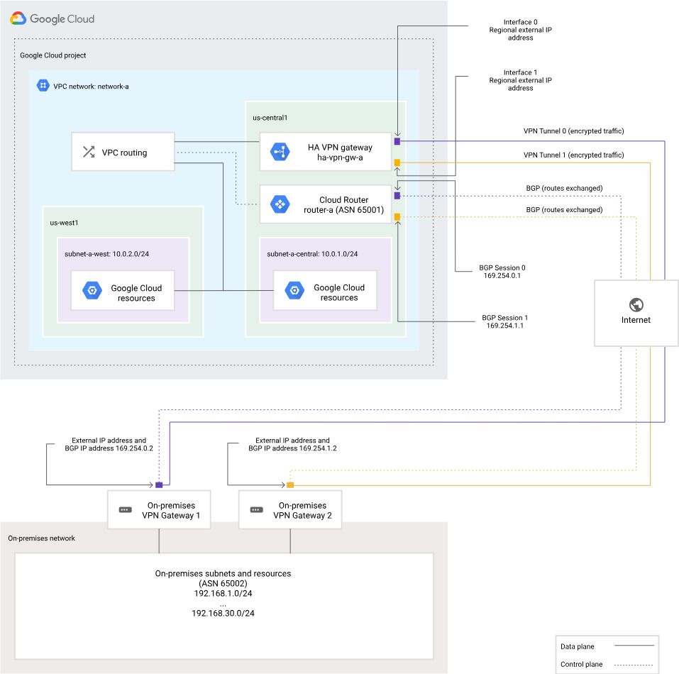

# 🌐 HA VPN with Google Cloud

**HA VPN** is a high-availability Cloud VPN solution that securely connects your **on-premises network** to your **Google Cloud VPC network** using an **IPsec VPN tunnel**.

Depending on your configuration, HA VPN can provide a **Service Level Agreement (SLA)** of **99.9% or 99.99%** availability.

---

## ⚙️ Key Concepts

### 🔒 What is HA VPN?

* HA VPN uses a **Google Cloud external VPN gateway** resource to define your **peer VPN gateway**.
* When you create an HA VPN gateway, Google automatically allocates **two external IP addresses**, one per interface.
* Each interface supports **multiple tunnels** for failover and high availability.

---

### 🧭 Options with Cloud Interconnect

#### 🔗 1. Dedicated Interconnect

* **What it is**: Physical fiber connections directly from Google at a colocation facility.
* **You need**:

  * Your own router in a Google-supported colocation facility
  * A network team to manage BGP, redundancy, and failover
* **Benefit**: High capacity (10–100 Gbps), ultra-low latency, private connectivity

#### 🤝 2. Partner Interconnect

* **What it is**: Google works with a **third-party provider** (e.g., Megaport, Equinix) to connect your location to Google Cloud.
* **You need**:

  * A provider from Google’s Partner list
  * No physical presence in Google's colocation
* **Benefit**: Cost-effective and flexible connectivity

> ⚠️ **Note**: If you use **Partner Interconnect**, you **must add IPsec encryption** to meet compliance and security requirements.

---

## 📦 VLAN Attachment

A **VLAN attachment** is the link between your **on-premises router** (via Dedicated or Partner Interconnect) and your **Google Cloud VPC**. It uses a **VLAN ID** to logically tag and isolate traffic across the same physical circuit.

---

## 🔁 Dynamic Border Gateway Protocol (BGP) Routing

**Dynamic BGP** routing allows **automatic exchange of routing info** between your on-prem and Google Cloud networks.

### 🛠️ How it Works:

Imagine you're using a **Site-to-Site VPN** between:

* Your on-prem router (**ASN 65000**)
* Google Cloud or AWS (**ASN 16550 or 7224**)

Instead of static routes:

✅ You enable **BGP**, and both sides **automatically exchange**:

* CIDRs (e.g., `10.140.0.0/20`, `192.168.1.0/24`)
* Next-hop details
* Route preferences

This enables:

* ✅ Redundancy
* ✅ Automatic failover
* ✅ Scalability without manual updates

---

## 🔄 High Availability Design Tips

* If **two peer devices** are used, connect each to **a different interface** of the HA VPN gateway.
* If your **peer is another cloud provider** (like AWS), ensure you configure **redundant VPN tunnels** on their side too.
* Your peer VPN device **must support dynamic BGP**.

---

## 📸 Network Architecture Overview

